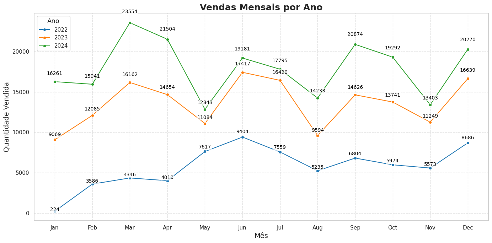
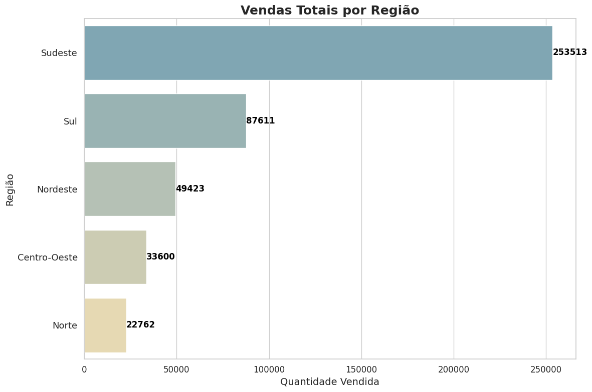
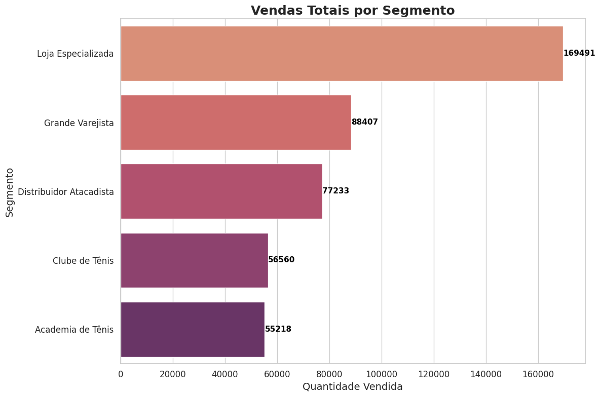
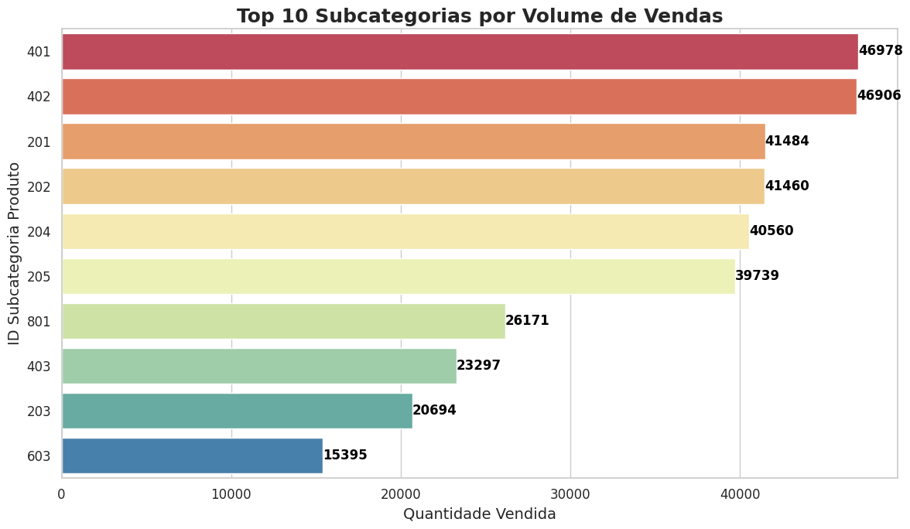
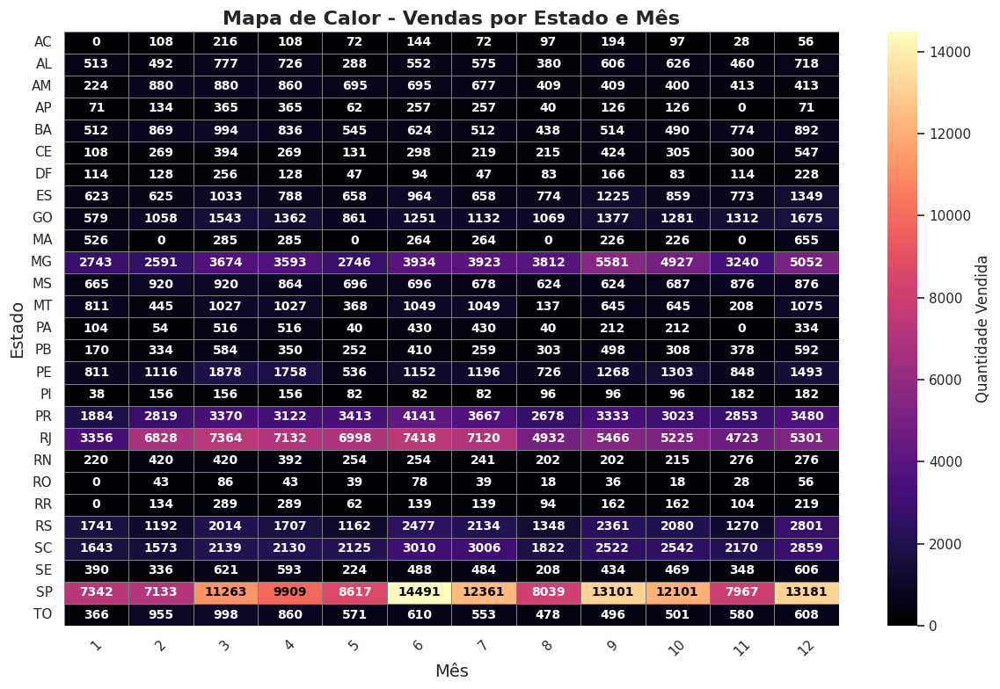
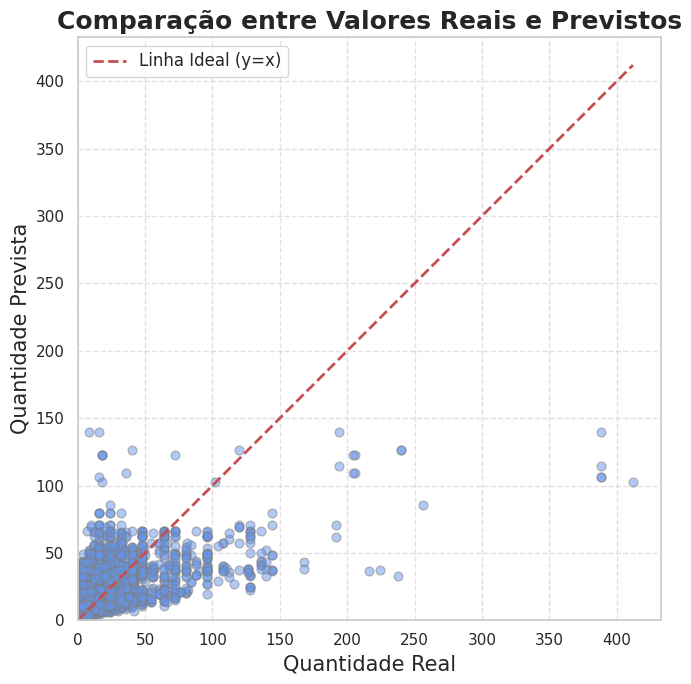

# Projeto de Data Science – Análise e Modelagem de Vendas BeachTennis
  
## Tema do Projeto

Análise exploratória e modelagem preditiva de dados de vendas, com o objetivo de compreender o comportamento das vendas por região, segmento e subcategoria, além de prever a quantidade de itens vendidos utilizando técnicas de aprendizado de máquina.

## Repositório no GitHub

O projeto está hospedado no seguinte repositório do GitHub:

[https://github.com/vaesgabriel/projeto-beach-tennis.git](https://github.com/vaesgabriel/projeto-beach-tennis.git)

## Dataset Utilizado

Neste projeto, utilizamos um conjunto de dados que reúne informações mensais de vendas, distribuídas por região, segmento, estado e subcategoria de produtos. Os dados foram organizados para possibilitar análises detalhadas do desempenho comercial e servir como base para modelos preditivos.

A seguir, apresentamos a origem dos dados, as principais variáveis consideradas e as transformações aplicadas para adequação às técnicas de análise e modelagem.

### Origem

O dataset utilizado é fictício, criado para fins didáticos e de desenvolvimento do projeto. Os dados simulam registros de vendas mensais por região, segmento e subcategoria, permitindo a aplicação das técnicas de análise exploratória e modelagem preditiva abordadas. Apesar de simulados, os dados foram estruturados para refletir padrões plausíveis do mercado, garantindo relevância nas análises e resultados apresentados.

### Variáveis Principais

- **Ano**: Ano da venda (exemplo: 2023)  
- **Mês**: Mês da venda (1 a 12)  
- **Regiao**: Região da venda (exemplo: Sul, Sudeste)  
- **Estado**: Unidade federativa (exemplo: RS, SP)  
- **Segmento**: Tipo de canal ou mercado do produto (exemplo: Loja Especializada, Distribuidor, Atacado)  
- **IDSubcategoriaProduto**: Código da subcategoria do produto  
- **QuantidadeItens**: Quantidade de itens vendidos

### Transformações Realizadas

- Tratamento e limpeza dos dados, eliminando registros com valores faltantes ou inconsistentes  
- Agrupamento e sumarização dos dados para obtenção de vendas mensais por região, segmento e subcategoria  
- Criação de tabelas pivô para visualizações mais intuitivas, como mapas de calor por Estado e Mês  
- Codificação das variáveis categóricas por meio de OneHotEncoder para alimentar os modelos preditivos  
- Divisão dos dados em conjuntos de treino (80%) e teste (20%) para validação robusta dos modelos

## Modelos Utilizados ou Desenvolvidos

- **Regressão Linear:**  
  Modelo preliminar que estabelece relações lineares entre as variáveis preditoras (Ano, Mês, Região e Segmento) e a variável alvo (Quantidade de itens vendidos). Foi utilizado para obter uma referência simples do comportamento dos dados, permitindo identificar tendências e correlações básicas.

- **Random Forest Regressor:**  
  Modelo principal do projeto, baseado em um conjunto de árvores de decisão para regressão. Escolhido pela sua robustez e capacidade de capturar interações não lineares entre as variáveis categóricas e numéricas, além de lidar bem com dados heterogêneos e ruídos. O modelo foi implementado dentro de uma pipeline que automatiza o pré-processamento, incluindo codificação das variáveis categóricas via OneHotEncoder e treinamento do regressor, garantindo reprodutibilidade e facilidade de manutenção.

- **Pipeline de pré-processamento e modelagem:**  
  Integração das etapas de transformação dos dados e modelagem em um único fluxo, facilitando a aplicação consistente das transformações e o ajuste do modelo, além de permitir validação cruzada e testes rápidos em diferentes conjuntos de dados.

## Resultados Obtidos

- O modelo **Random Forest** apresentou um **Erro Quadrático Médio (MSE)** de aproximadamente **447.27**, o que indica que a média das diferenças quadráticas entre as previsões e os valores reais é relativamente baixa, demonstrando boa capacidade preditiva dentro do contexto dos dados utilizados.

- O **Coeficiente de Determinação (R²)** atingiu **0.35**, sugerindo que o modelo explica cerca de 35% da variabilidade total das vendas. Embora esse valor indique que há espaço para melhorias, ele é razoável dada a complexidade do problema e a natureza dos dados simulados.

- As análises exploratórias revelaram forte variação do volume de vendas por região, com destaque para as regiões **Sul** e **Sudeste**, que apresentam os maiores volumes, possivelmente refletindo maior concentração de mercado ou atividade comercial nessas áreas.

- O segmento de **equipamentos** destacou-se como o principal responsável pelo volume de vendas, seguido por outros segmentos (ajuste conforme os dados reais do seu dataset).

- As visualizações, incluindo gráficos de barras, mapas de calor e análises temporais, foram essenciais para identificar padrões sazonais, regionais e segmentados, auxiliando na compreensão dos fatores que influenciam o desempenho comercial e apoiando a tomada de decisões estratégicas.

- O workflow adotado permite a atualização contínua do modelo com novos dados, facilitando o re-treinamento e a melhoria progressiva do desempenho preditivo, o que é fundamental para manter a relevância e eficácia do modelo ao longo do tempo.

## Visualizações

### Gráfico 1 – Vendas mensais por ano  
Este gráfico mostra a evolução das vendas ao longo dos meses, separados por ano, permitindo observar sazonalidades ou tendências de crescimento.  

### Gráfico 2 – Total de vendas por região  
Aqui vemos o total de vendas acumuladas por região do Brasil, destacando a concentração de vendas no Sudeste e Sul.  

### Gráfico 3 – Participação das subcategorias nas vendas  
Este gráfico apresenta quais subcategorias de produtos mais contribuíram para o volume total de vendas.  

### Gráfico 4 – Distribuição de vendas por segmento  
Com este gráfico, visualizamos a divisão das vendas por tipo de canal de venda, como lojas especializadas, e-commerce, entre outros.  

### Gráfico 5 – Total de vendas por estado  
Distribuição do volume de vendas por unidade federativa, permitindo identificar os estados com maior participação.  

### Gráfico 6 – Comparativo entre segmentos e regiões  
Análise cruzada entre o tipo de segmento e a região, evidenciando onde cada canal performa melhor.  

### Gráfico 7 – Correlação entre variáveis preditoras  
Matriz de correlação que mostra as relações entre variáveis utilizadas na modelagem, útil para interpretação estatística.  

---